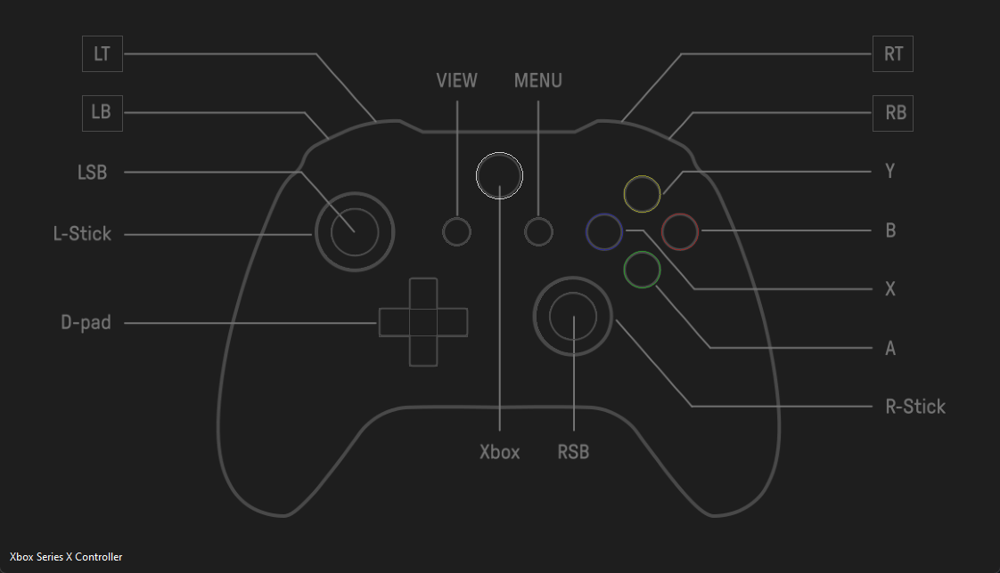

# GamePad Pulse

A Python application that provides real-time visualization and monitoring of gamepad/controller inputs using PyQt6 for the GUI and Pygame for controller input handling.



## Features

- Real-time monitoring of Xbox and other game controllers
- Visual display of controller layout
- Tracking of:
  - Button states (A, B, X, Y, bumpers, etc.)
  - Analog stick positions
  - Trigger inputs
  - D-pad states
- Live status log display

## Requirements

```txt
pygame==2.6.0
PyQt6==6.7.1
PyQt6-Qt6==6.7.2
PyQt6_sip==13.8.0
```

## Installation

1. Clone this repository
2. Install dependencies:
   ```sh
   pip install -r requirements.txt
   ```

## Usage

Run the application using:

```sh
python src/main.py
```

Connect a controller and the application will automatically detect it and display its inputs in real-time.

## Project Structure

- main.py - Application entry point and main loop
- Model.py - Data model for controller states
- View.py - GUI implementation
- Controller.py - Input handling and event processing

## Architecture

The project follows the Model-View-Controller (MVC) pattern:
- Model: Maintains controller states and data
- View: Renders the GUI and controller status
- Controller: Handles input events and updates the model

## Support

Currently tested with Xbox controllers, but should work with other game controllers supported by Pygame.
